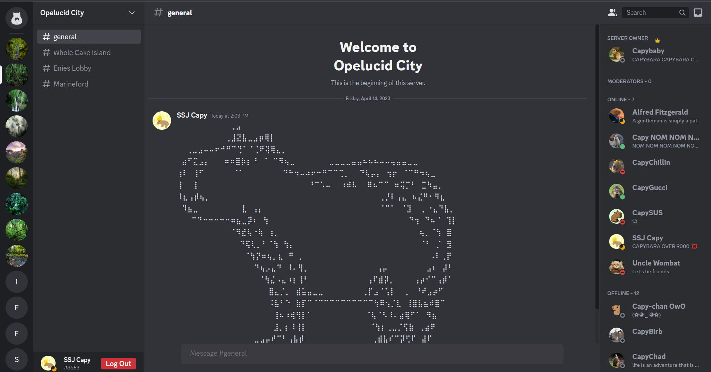
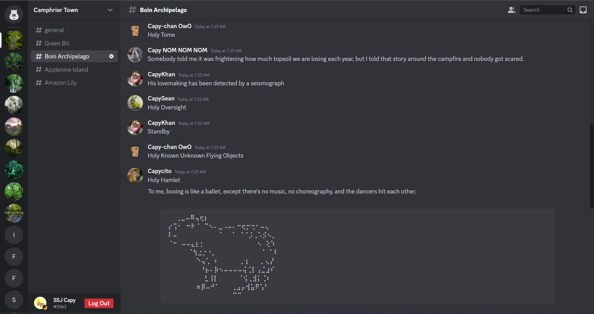

# Capycord

[Click here to check out the live site](https://capycord.onrender.com)

## What is Capycord?

Capycord is a clone of [Discord](https://discord.com/), a popular text/video/voice chat app where individuals and communities come together to hang out. Users can create servers for their friends and communities. Servers can be organized with different channels, and can be customized with a profile photo and name. Users also have friend lists to manage their friends and check who is online or not, as well as customize their own status, profile photo, and username. Users can also direct message each other and see notifications. I chose to clone Discord because I primarily hang out with friends online there.

___

## Technologies used

* Languages: JavaScript, Ruby, HTML, CSS
* Frontend: React-Redux
* Backend: Ruby on Rails
* Databases: PostgreSQL, Redis
* Hosting: Render
* Storage: AWS Simple Storage Service (S3)

___

## Feature List

### Servers

___

Servers are where groups of people can text each other. Can also view the members listing and get live updates on member status changes.

### Friends List

___

Users can manage their friends, filter by their online status, and manage sent and incoming friend requests. Friend listings are live updated when any friend status changes or friends get added/deleted.

### Live Chat

___

Users can message each other within server channels. Can post and delete messages which gets updated in realtime for everyone seeing the channel.

### Notifications

___

Includes live updates for change in member status, friends, requests, and messages.

Implemented in the Rails backend using Action Cable, and using an Action Cable npm library in the React frontend. Uses a redis database to manage web connections.

